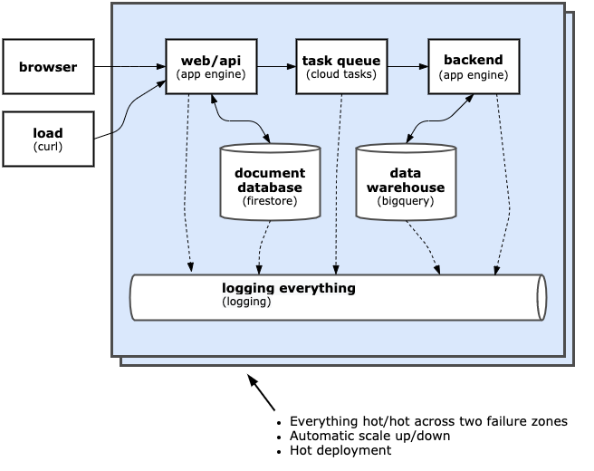

# Hello Google Serverless



This is a non-trivial serverless web application using NodeJS 10 and the following services:
- Web app server (App Engine)
- Task queue (Cloud tasks)
- Backend (App Engine)
- Document database (Cloud Firestore)
- Data warehouse (BigQuery)
- Logging (built into all services)


All aspects of the solution:
- Run hot/hot across 2 or more failure zones
- Automatically scale up and down to handle load
- Automatically manage hot deploy where relevant


# Installation & deployment using Google Cloud Shell
## Create a new project

**NOTE:**  Delete the project when you're done to avoid incurring unneccessary charges.  This setup will leave one instance running which is not an issue for demo, but may incur charges if you leave it running for a month :)
- Head over to [Google Cloud Console](https://console.cloud.google.com/)
- Sign in using a gmail or gsuite account
- Check [billing is enabled](https://console.cloud.google.com/billing)
  - This typically doesn't incur charges if you follow the note above.
  - If it's your first time, sign up for free credits, this enables billing.
  - Otherwise, set up a new billing account
- Create a [new project](https://console.cloud.google.com/projectcreate)
- Make a note of your **project ID** (this is not always the same as project name)
- When notification (top right) is done, navigate to the project using the "SELECT PROJECT" 

## Use Google Cloud Shell to clone and deploy

Launch the Google Cloud Shell (top right nav) - this will be your dev machine for the demo.

Check out the code:
```
git clone https://github.com/shanebell/hello-google-serverless.git
```

Enable the serverless services (retry if prompted):
```
gcloud app create --region australia-southeast1
gcloud services enable cloudtasks.googleapis.com firestore.googleapis.com
gcloud firestore databases create --region=australia-southeast1  
```   

Deploy the app:
```
cd hello-google-serverless
gcloud app deploy
```

## Use the app

Navigate to http://{project-id}.appspot.com

Type something in, hit \<return\> and it should play it back to you once it's stored in the database

## Pseudo load test
To demonstrate App Engine auto-scaling, you can run:\
```
seq 1000 | parallel -i -j 60 curl -s -o /dev/null -w "{}:" "https://<PROJECT_ID>.appspot.com/test?load={}"`
```

# Local dev
To run the app locally:
- Follow the instructions [here](https://cloud.google.com/docs/authentication/getting-started) to download a service account credential file and save in the local directory as `credentials.json` 
- Install npm dependencies: `npm i`
- Run the application on port 8080: `GOOGLE_APPLICATION_CREDENTIALS=./credentials.json npm start`

